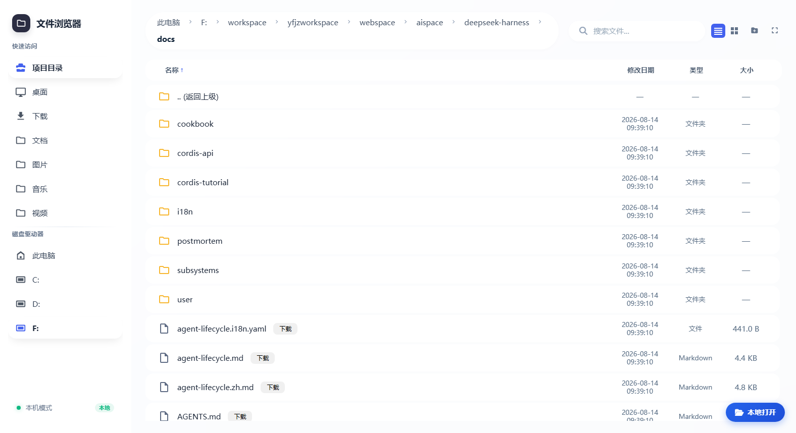
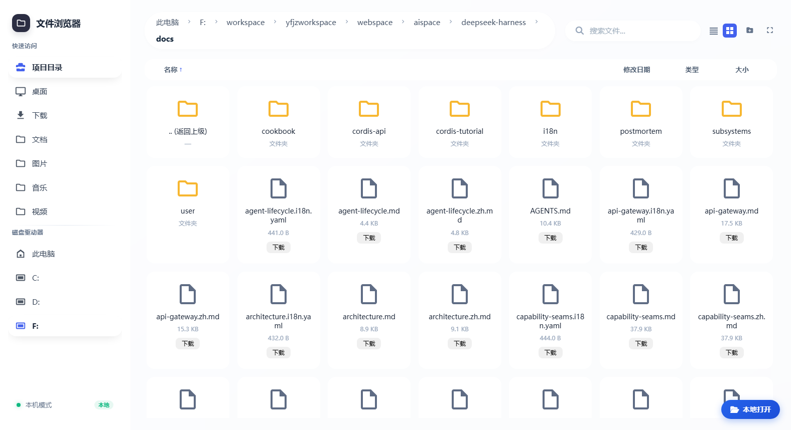
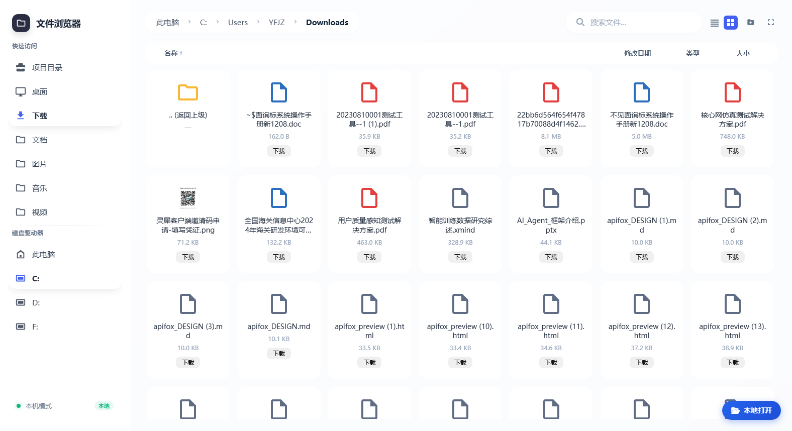
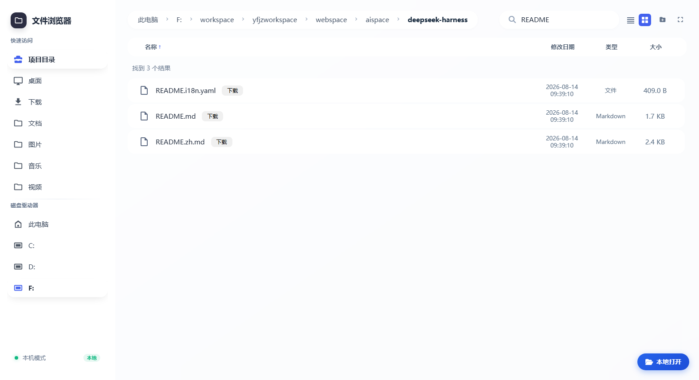
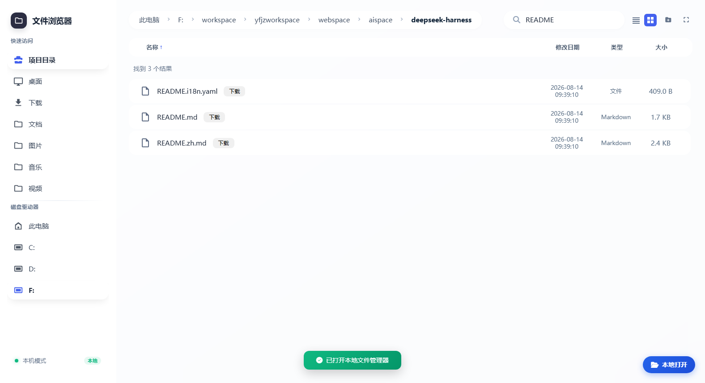

# @open-agfs/dsh-agfs

English | [中文](README.zh.md)


**A file-browser web app for DeepSeek Harness** — a React frontend and REST API served by the host webserver, plus a `/dsh-agfs` command and a `browse_files` model tool. It rides the composing `dsh web` server: no separate port, no subprocess.


## Features

| 面包屑导航 Breadcrumbs | 视图切换 View switch | 侧边栏 Sidebar |
| --- | --- | --- |
|  |  |  |

| 搜索 Search | 本地打开 Local open |
| --- | --- |
|  |  |

- **面包屑导航** — clickable breadcrumbs navigate every level of the current path back to the root.
- **视图切换** — list and card (grid) views, one click apart.
- **三种显示尺寸** — a toolbar button (showing the current mode) cycles 视图大小 (windowed panel, the default) → 整个视图 (fills the viewport) → 全屏 (browser fullscreen).
- **侧边栏** — project directory, quick access (Desktop/Downloads/Documents…), custom roots, and drives.
- **搜索** — toolbar search with optional recursive mode (200-hit cap).
- **本地打开** — in local mode, a floating button in the bottom-right opens the system file manager at the current directory.
- **一键AI分析** — right-click a file/folder → enter a requirement → dsh creates a workspace for that directory and wakes a fresh session whose agent analyzes it (local mode only).
- **Full file browser** — list/search, text preview (markdown, code, logs), image preview, and create/rename/copy/delete folders.
- **`/dsh-agfs` command** — opens the file browser in the system default browser and **automatically navigates to the current session's workspace directory** (session cwd); switch workspaces and it follows.
- **`browse_files` model tool** — the model can list or recursively search the browser root directly.
- **Path safety** — browsing confined to the root, `strictRoot` real-path checks, symlink/junction escape interception (clean 400 envelope), `readOnly` mode, `remoteMode`.
- **Offline frontend** — React/ReactDOM ship in the package; boots without a CDN or Babel.
- **Security headers** — `X-Content-Type-Options: nosniff`, `X-Frame-Options: DENY`, `Referrer-Policy: no-referrer`.
- **`dsh.bundle` one-line install** — activates as a profile layer.

## Install

### Option 1: one-click via natural language in the dsh dialog (recommended)

In the **DeepSeek Harness web dialog**, ask the agent directly, for example:

> Install the file-browser plugin `dsh-agfs`

> Install the npm package `@open-agfs/dsh-agfs`

The agent invokes a shell tool to run:

```sh
dsh plugin --profile web add @open-agfs/dsh-agfs
```

Then **restart dsh web** (or ask the agent to restart it) and run `/dsh-agfs` in the dialog to open the file browser.

> **Prerequisite**: this flow needs the agent's shell tools (`bash`/`pwsh`) enabled and permitted. The web profile disables shell tools by default — enable them under Settings → tools/permissions, or approve the command when the agent asks. Without shell tools, use Option 2.

### Option 2: one-line CLI install

```sh
dsh plugin --profile web add @open-agfs/dsh-agfs
```

After the install, **restart dsh web** and run `/dsh-agfs` in the dialog.

**Upgrade to the latest version**:

```sh
dsh plugin --profile web add @open-agfs/dsh-agfs@latest
```

### Option 3: source overlay (for development)

From a checkout of this repository, mount the source through a `--patch` overlay:

```yaml
- insert:
    - id: dsh-agfs
      name: 'file:///absolute/path/to/dsh-agfs/src/index.ts'
```

then `dsh web --patch ./overlay.yml`. Plugin code changes need a dsh restart; frontend assets are served from disk per request.

## Usage

- Run `/dsh-agfs` in the dialog: the system default browser opens the file browser and reports its URL; **when the current session carries a workspace directory (session cwd), the browser boots directly at that workspace**.
- With `openOnCommand: false` the URL is only reported, the browser is not opened.
- Click a file to preview text/images; use the toolbar search (recursive, 200-hit cap); the sidebar offers quick access (Desktop/Downloads/Documents…), custom roots, and drives; right-click for create folder / rename / copy / delete (subject to `readOnly`).

## Config

| Key | Default | Meaning |
|---|---|---|
| `basePath` | `/dsh-agfs` | Webserver route prefix serving the app and its API; must start with `/` and have no trailing slash. |
| `fileRoot` | current working directory | File-browser root; drives stay reachable through the sidebar. |
| `projectRoot` | working directory | Project root shown in the sidebar. |
| `remoteMode` | `false` | When true, the `open`, `open_location`, and `copy` endpoints are disabled. |
| `readOnly` | `false` | When true, the `delete`, `create_folder`, `rename`, and `copy` endpoints answer 403; browsing stays fully readable. |
| `strictRoot` | `false` | When true, browsing is locked inside `fileRoot`: absolute paths are rejected and symlink/junction escapes fail with a 400 envelope. |
| `roots` | `{}` | Named browse roots shown in the sidebar as `name -> path`; entries that do not resolve to an existing directory are dropped. |
| `openOnCommand` | `true` | Whether `/dsh-agfs` opens the system default browser. |
| `debug` | `false` | When true, API calls and system-open results are logged to the dsh process stderr with a `[dsh-agfs:debug]` prefix. |

Config lives in the profile's user patch layer (`$DSH_HOME/profiles/<name>/cordis.patch.yml`):

```yaml
- id: dsh-agfs
  config:
    fileRoot: 'D:/projects/my-project'
    readOnly: true
```

## API

The frontend calls the endpoint set under `${basePath}/api/file_browser/`: `list`, `read`, `download`, `open`, `open_location`, `search`, `info`, `workspace`, `sidebar`, `thumbnail`, `mode`, `debug`, `delete`, `create_folder`, `rename`, `copy`, and `analyze` (one-click AI analysis, local mode only). Paths are confined under the browsable root. `search` accepts `recursive=1` (also `true`/`yes`) with a 200-hit cap and a directory-depth cap of 5. Every response carries the security headers; static assets answer GET/HEAD only.

## Model tool

The plugin registers `browse_files` (parameters `path`, `keyword`, `recursive`) over the same pure core the HTTP layer uses; the model can list or search the browser root directly. It returns a canonical `{ items: [...] }` value rendered as `TYPE<TAB>SIZE<TAB>PATH` text lines; the parameter schema and description flow into the assembled prompt like every other registered tool.

## Known Limitations

- **Font Awesome icons load from cdnjs** — boot no longer needs a CDN (React/ReactDOM are vendored and Babel is eliminated by the precompiled `app.js`), but the toolbar icons still come from cdnjs; without network access the app works without icons.
- **Shallow search only** — `search` matches entry names in one directory (200-hit cap); recursive content search is not implemented.
- **Thumbnails stream the original image** — no resize is performed; large images are sent in full and scaled by CSS.
- **`openOnCommand` spawns on the host** — the browser opens on the machine running dsh, which is correct for a loopback deployment but surprising for remote clients.

## Development

```sh
pnpm install
pnpm test        # vitest: unit suites plus the real-Loader composition suite (94 tests)
pnpm typecheck   # tsc --noEmit
pnpm lint        # oxlint
pnpm build       # tsc types + tsdown bundles -> lib/
pnpm run build:frontend   # regenerate assets/app.js after editing assets/app.jsx
```

The frontend source is `assets/app.jsx`; its compiled form `assets/app.js` (classic JSX runtime, no Babel at runtime) and the vendored React/ReactDOM UMD builds under `assets/vendor/` ship in the package so the app boots without a CDN.

## Publishing

Releases are tag-driven: pushing a `v*` tag triggers GitHub Actions (`.github/workflows/publish.yml`) to publish to npm. **Tags are cut manually — the script never tags on its own**:

```sh
pnpm run release                    # report release state only (no writes)
pnpm run release -- --do            # cut a release now (patch bump): commit + tag + push
pnpm run release -- --do --version 0.2.0   # cut a release at a chosen version
pnpm run release -- --do --dry-run  # preview without writing or pushing
```

`scripts/release.mjs` without flags prints the current version, the last `v*` tag, and the commit count since it; with `--do` it bumps the version, commits `chore: release vX.Y.Z`, creates the tag, and pushes `main` + the tag. The repository needs an `AGFS` secret (a granular npm publish token with bypass-2FA). The package declares the published `@deepseek-ai/dsh-*` harness packages as peers, so a published install resolves them from npm.

## Star History

<a href="https://star-history.com/#openAGFS/dsh-agfs&Date">
  <picture>
    <source media="(prefers-color-scheme: dark)" srcset="https://api.star-history.com/svg?repos=openAGFS/dsh-agfs&type=Date&theme=dark" />
    <source media="(prefers-color-scheme: light)" srcset="https://api.star-history.com/svg?repos=openAGFS/dsh-agfs&type=Date&theme=light" />
    
  </picture>
</a>

## Links

- npm: https://www.npmjs.com/package/@open-agfs/dsh-agfs
- Source: https://github.com/openAGFS/dsh-agfs
- Requirements: Node `^22.19 || >=24`; peers `@deepseek-ai/dsh-*` (rc.6)
