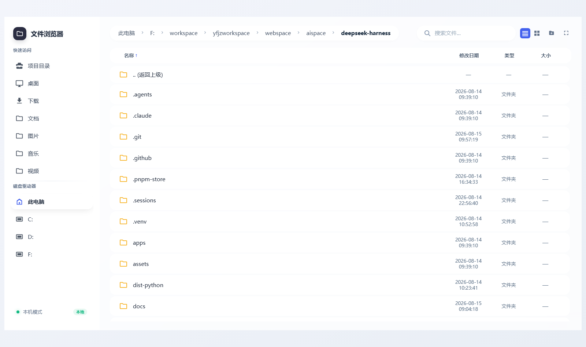
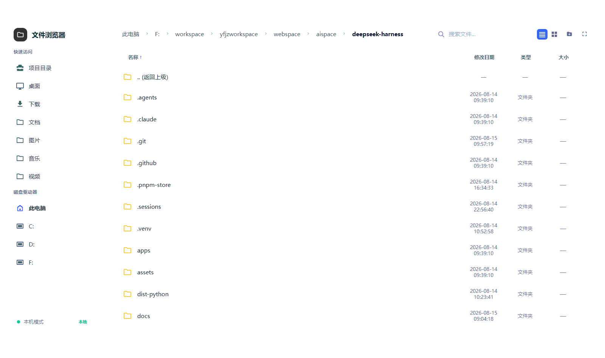
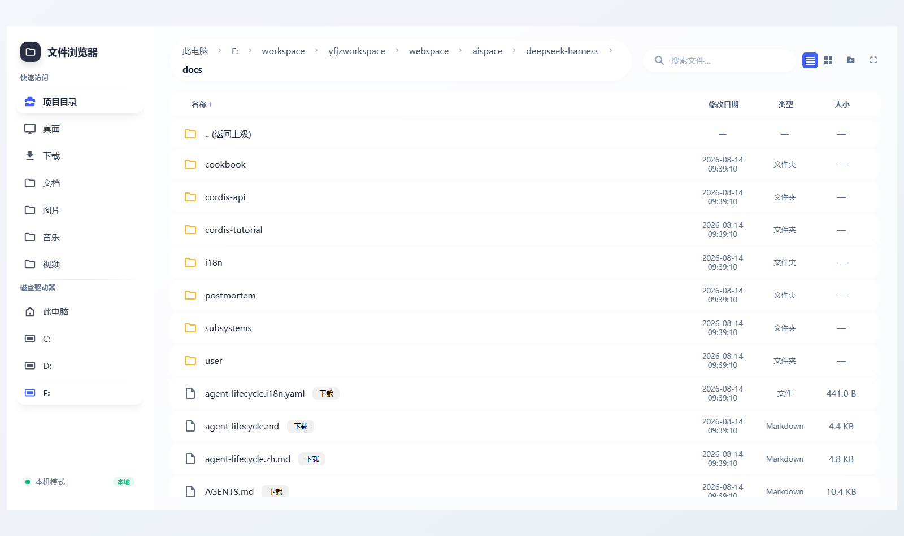
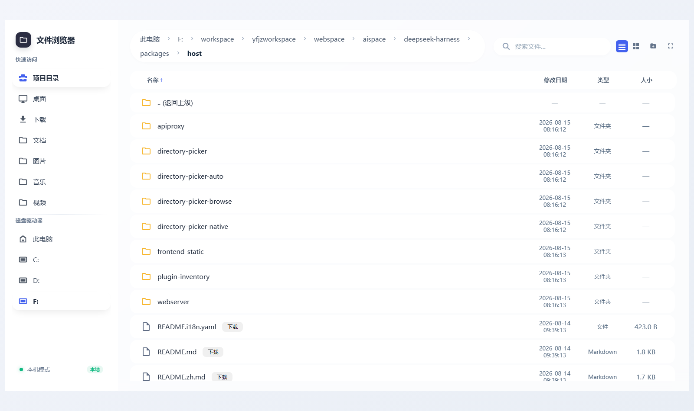

# @open-agfs/dsh-agfs

[English](README.md) | 中文



**面向 DeepSeek Harness 的文件浏览器插件**——由宿主 webserver 托管的 React 前端与 REST API，附带 `/dsh-agfs` 命令与 `browse_files` 模型工具。随 `dsh web` 同进程运行：无独立端口、无子进程。



## 功能

| 文件浏览 | 目录与文本预览 | 侧边栏 |
| --- | --- | --- |
|  |  |  |

- **完整文件浏览器**——列表/搜索、文本预览（markdown、代码、日志）、图片预览，支持新建/重命名/复制/删除文件夹。
- **`/dsh-agfs` 命令**——在系统默认浏览器中打开文件浏览器，并**自动定位到当前会话的工作区目录**（session cwd）；切换工作区后再次执行会自动跟随。
- **本地打开按钮**——本机模式下右下角悬浮按钮，一键用系统文件管理器打开当前目录。
- **`browse_files` 模型工具**——模型可直接列出或递归搜索浏览根。
- **路径安全**——浏览根限定、`strictRoot` 实路径校验、符号链接/连接点逃逸拦截（干净 400 信封）、`readOnly` 只读模式、`remoteMode` 远程禁用。
- **离线前端**——React/ReactDOM 随包发布，无 CDN、无 Babel 即可启动。
- **安全响应头**——`X-Content-Type-Options: nosniff`、`X-Frame-Options: DENY`、`Referrer-Policy: no-referrer`。
- **`dsh.bundle` 一键安装**——作为 profile 层一条命令激活。

## 安装

### 方式一：在 dsh 对话框用自然语言一键安装（推荐）

在 **DeepSeek Harness web 界面**的对话框里，直接用自然语言让智能体安装，例如：

> 帮我安装文件浏览器插件 `dsh-agfs`

> 安装 `@open-agfs/dsh-agfs` 这个 npm 包

智能体会调用 shell 工具执行：

```sh
dsh plugin --profile web add @open-agfs/dsh-agfs
```

然后**重启 dsh web**（或让智能体帮你重启），在对话框输入 `/dsh-agfs` 即可打开文件浏览器。

> **前置条件**：该方式要求当前 profile 的智能体启用了 shell 工具（`bash`/`pwsh`）并授予执行权限。web profile 默认禁用 shell 工具——可在「设置 → 工具/权限」中启用，或当智能体请求执行命令时选择允许。未启用时请用方式二。

### 方式二：命令行一行安装

```sh
dsh plugin --profile web add @open-agfs/dsh-agfs
```

安装完成后**重启 dsh web**，在对话框输入 `/dsh-agfs` 打开文件浏览器。

**升级到新版本**：

```sh
dsh plugin --profile web add @open-agfs/dsh-agfs@latest
```

### 方式三：源码覆盖层（开发用）

从仓库检出用 `--patch` 覆盖层挂载源码：

```yaml
- insert:
    - id: dsh-agfs
      name: 'file:///绝对路径/dsh-agfs/src/index.ts'
```

然后 `dsh web --patch ./overlay.yml`。插件代码改动需重启 dsh；前端资源按请求从磁盘读取。

## 使用

- 在 dsh 对话框输入 `/dsh-agfs`：系统默认浏览器打开文件浏览器并返回地址；**若当前会话带有工作区目录（session cwd），浏览器会直接定位到该工作区**。
- 设置 `openOnCommand: false` 时只返回地址，不打开浏览器。
- 点击文件预览文本/图片；顶栏搜索（支持递归，200 命中上限）；侧边栏快速访问桌面/下载/文档等目录、自定义根与磁盘；右键文件可新建文件夹/重命名/复制/删除（受 `readOnly` 限制）。

## 配置

| Key | 默认 | 含义 |
|---|---|---|
| `basePath` | `/dsh-agfs` | 服务应用与 API 的路由前缀；必须以 `/` 开头且不以 `/` 结尾 |
| `fileRoot` | 当前工作目录 | 浏览根；侧边栏仍可访问各磁盘 |
| `projectRoot` | 当前工作目录 | 侧边栏「项目目录」 |
| `remoteMode` | `false` | 为 true 时禁用 `open`、`open_location`、`copy` 端点 |
| `readOnly` | `false` | 为 true 时 `delete`、`create_folder`、`rename`、`copy` 返回 403；浏览保持可读 |
| `strictRoot` | `false` | 为 true 时浏览锁定在 `fileRoot` 内：拒绝绝对路径，符号链接/连接点逃逸返回 400 |
| `roots` | `{}` | 侧边栏自定义根，`name -> path`；解析不到的条目自动丢弃，其余按名排序 |
| `openOnCommand` | `true` | `/dsh-agfs` 是否自动打开系统默认浏览器 |

配置写在 profile 的用户补丁层（`$DSH_HOME/profiles/<name>/cordis.patch.yml`），例如：

```yaml
- id: dsh-agfs
  config:
    fileRoot: 'D:/projects/my-project'
    readOnly: true
```

## API

前端调用 `${basePath}/api/file_browser/` 下的端点：`list`、`read`、`download`、`open`、`open_location`、`search`、`info`、`workspace`、`sidebar`、`thumbnail`、`mode`、`debug`、`delete`、`create_folder`、`rename`、`copy`。路径被限定在浏览根内；`search` 支持 `recursive=1`（也接受 `true`/`yes`）递归遍历，命中上限 200、目录深度上限 5。所有响应带安全响应头；静态资源只响应 GET/HEAD。

## 模型工具

插件注册 `browse_files` 工具（参数 `path`、`keyword`、`recursive`），复用与 HTTP 层相同的纯函数核心——模型可直接列出或搜索浏览根。工具返回规范值 `{ items: [...] }`，渲染为 `TYPE<TAB>SIZE<TAB>PATH` 文本行；参数 schema 与描述随工具注册自动流入模型提示词。

## 已知局限

- **Font Awesome 图标来自 cdnjs**——启动无需 CDN（React/ReactDOM 随包、Babel 由预编译 `app.js` 取代），但工具栏图标仍来自 cdnjs；无网络时应用可用但无图标。
- **仅浅层搜索**——`search` 匹配单目录条目名（上限 200），未实现递归内容搜索。
- **缩略图流式返回原图**——不做缩放，大图完整传输并由 CSS 缩放。
- **`openOnCommand` 在宿主机上产生副作用**——浏览器在运行 dsh 的机器上打开，loopback 部署正确，对远程客户端有违直觉。

## 开发

```sh
pnpm install
pnpm test        # vitest：单元套件 + 真实 Loader 组合套件（94 测试）
pnpm typecheck   # tsc --noEmit
pnpm lint        # oxlint
pnpm build       # tsc 类型 + tsdown 打包 -> lib/
pnpm run build:frontend   # 修改 assets/app.jsx 后重新生成 assets/app.js
```

前端源码 `assets/app.jsx`，编译产物 `assets/app.js`（classic JSX runtime，无 Babel）与 `assets/vendor/` 下的 React/ReactDOM UMD 构建随包发布。

## 发布

发布由 tag 驱动：推 `v*` tag 会触发 GitHub Actions（`.github/workflows/publish.yml`）自动发布到 npm。为降低发布噪音，**每累计 10 次提交到 `main` 才发一次版**——用规则脚本执行：

```sh
pnpm run release            # 累计满 10 次提交时才发版
pnpm run release -- --dry-run   # 预览（不写入、不推送）
```

`scripts/release.mjs` 统计自上次 `v*` tag 以来的提交数：不足阈值时只打印进度、不做任何事；达到阈值时递增 patch 版本、提交 `chore: release vX.Y.Z`、创建 tag 并推送 `main` 与 tag。仓库需配置 `NPM_TOKEN` secret。本包把已发布的 `@deepseek-ai/dsh-*` 工具链包声明为 peer 依赖，发布安装可从 npm 解析。

## Star History

<a href="https://star-history.com/#openAGFS/dsh-agfs&Date">
  <picture>
    <source media="(prefers-color-scheme: dark)" srcset="https://api.star-history.com/svg?repos=openAGFS/dsh-agfs&type=Date&theme=dark" />
    <source media="(prefers-color-scheme: light)" srcset="https://api.star-history.com/svg?repos=openAGFS/dsh-agfs&type=Date&theme=light" />
    
  </picture>
</a>

## 链接

- npm：https://www.npmjs.com/package/@open-agfs/dsh-agfs
- 源码：https://github.com/openAGFS/dsh-agfs
- 环境要求：Node `^22.19 || >=24`；peer 依赖 `@deepseek-ai/dsh-*`（rc.6）
